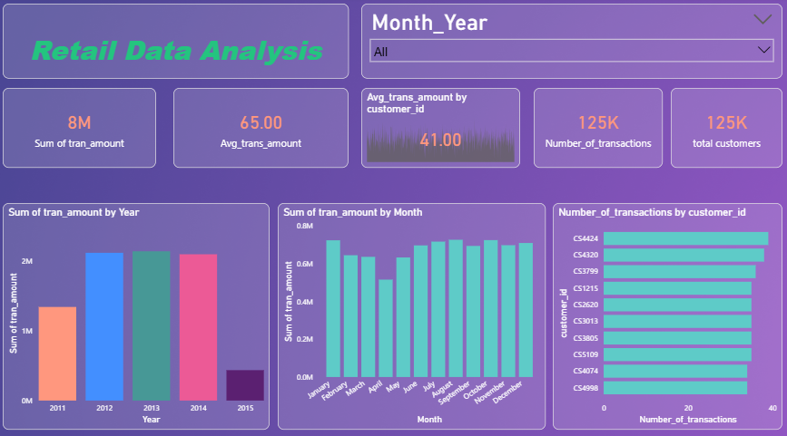

# 📊 Power BI Retail Data Analysis Dashboard

## Project Overview  
This project is an interactive **Power BI dashboard** built to analyze **retail transaction data** and provide insights into **sales performance, customer behavior, and transaction patterns**.

The dashboard enables stakeholders to monitor **total revenue, average transaction value, customer activity, and time-based sales trends**.

---

## Objectives  
The main objectives of this project are:

- To track **overall retail sales revenue**
- To calculate **average transaction amount**
- To analyze **customer-wise transaction behavior**
- To monitor **monthly and yearly sales trends**
- To measure **total number of transactions and customers**
- To enable **interactive time-based analysis**

---

## Dashboard Overview  

### Key Performance Indicators (KPIs)

- **Sum of Transaction Amount** – Total revenue generated  
- **Average Transaction Amount** – Mean value per transaction  
- **Average Transaction by Customer** – Customer-level spending behavior  
- **Number of Transactions** – Total transaction count  
- **Total Customers** – Unique customers  

---

### Visual Analytics  

#### 1. Sales by Year  
Bar chart showing **sum of transaction amount by year**, helping identify long-term performance trends.

#### 2. Sales by Month  
Column chart displaying **monthly sales trend**, highlighting seasonality and peak months.

#### 3. Transactions by Customer  
Horizontal bar chart showing **number of transactions by customer ID**, identifying high-frequency customers.

---

## Dashboard Screenshot  

### Retail Data Analysis Dashboard  
Interactive dashboard with KPIs and time-based transaction insights.  

---

## Key Features  

- Dynamic slicer for **Month_Year**  
- KPI-based executive reporting  
- Customer-level behavior analysis  
- Monthly and yearly trend analysis  
- Clean and business-friendly UI  

---

## Business Use Cases  

This dashboard can be used for:

- Retail performance monitoring  
- Customer segmentation  
- Sales trend analysis  
- Identifying loyal customers  
- Marketing strategy planning  
- Revenue forecasting  

---

## Tools & Technologies  

- **Power BI Desktop**
- **DAX (Data Analysis Expressions)**
- **Power Query (ETL)**
- Data modeling and relationships  
- Interactive visual analytics  

---

## Data Model  

The dataset includes the following key fields:

- `Transaction_ID`  
- `Customer_ID`  
- `Transaction_Date`  
- `Month_Year`  
- `Transaction_Amount`  

---

## Key Learnings  

Through this project, I gained hands-on experience in:

- Designing KPI-based dashboards  
- Performing customer transaction analysis  
- Creating time-series sales reports  
- Writing DAX measures  
- Building clean analytical interfaces  

---

## Future Enhancements  

- Add product-level analysis  
- Include customer lifetime value (CLV)  
- Add region-wise performance  
- Implement forecasting models  
- Publish to Power BI Service  

---

## Author  

**Mohammad Sayam Fareez**  
Aspiring Data Analyst | Power BI Developer  
Electronics Engineering Graduate (2025)

